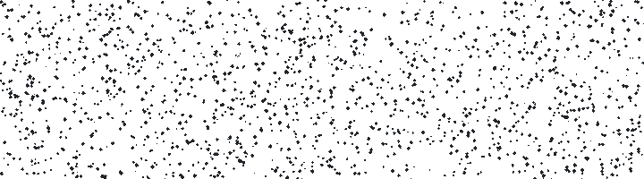

<picture>
  <source media="(prefers-color-scheme: dark)" srcset="assets/yah264-dark.gif">
  
</picture>

An H.264/AVC encoder.

The goal is to build a fast H.264 encoder that I plan to adapt and use for
experimental encoding optimization projects.

I am using x264 as a performance and quality baseline.

Development is macOS/arm64 first with with NEON SIMD. I plan to follow up with x86-64 (SSE4.2 through AVX2) and others. See [docs/plan.md](docs/plan.md).

Where it stands: Compared to x264 we lead with pure C, and the shipped
NEON build ties it on small clips but runs noticeably slower at 1080p. This is mainly due to our SIMD still losing to x264's hand-written assembly.

## Documentation

- [Introduction](https://terranvigil.github.io/yah264/)
- [How video encoding works](https://terranvigil.github.io/yah264/encoding.html)
- [How H.264 works](https://terranvigil.github.io/yah264/how-h264-works.html)
- [Getting Started](https://terranvigil.github.io/yah264/start.html)
- [Design](https://terranvigil.github.io/yah264/design.html)
- [Threading](https://terranvigil.github.io/yah264/threading.html)
- [Results](https://terranvigil.github.io/yah264/results.html)

## Build

Requires a C11 compiler, Meson >= 1.1, and Ninja.

```sh
meson setup build && ninja -C build
meson test -C build
```

Read about using yah264 to encode [here](https://terranvigil.github.io/yah264/start.html)
including as a library inside ffmpeg with `-c:v libyah264`.

## Contributing

Issues and pull requests are welcome. `CONTRIBUTING.md` has the ground rules.

Every change has to clear the recon-match gate, where the encoder's own
reconstruction must equal an independent decoder's output bit-for-bit. `make
test` runs the unit tests and `make conformance` runs the gate.

## License

BSD-2-Clause, stated per file as well as in `LICENSE`.
